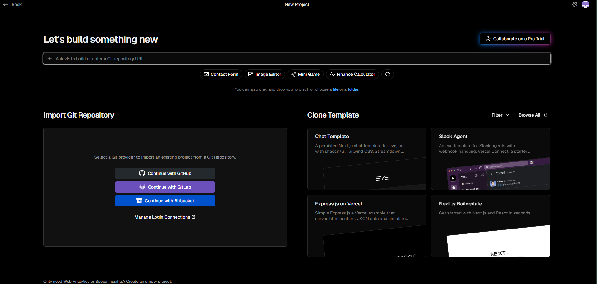
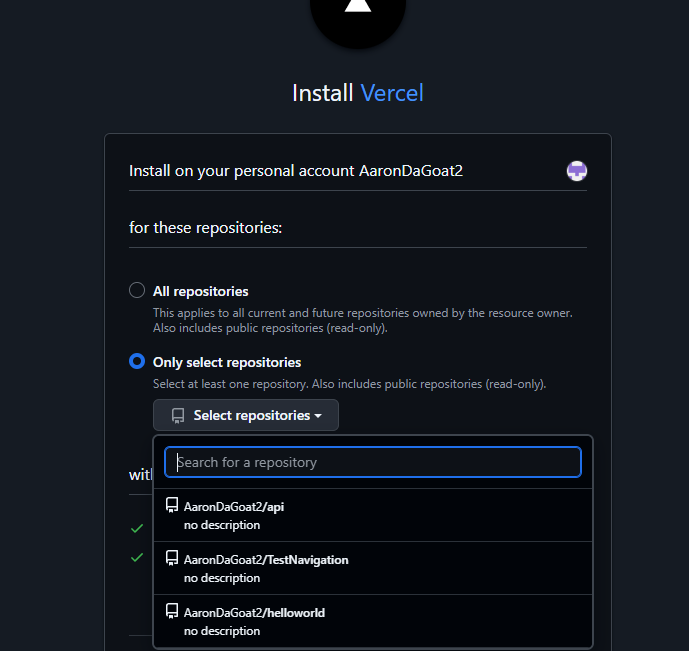

# 🔒 RubaStudio Auth & Mail API

API Serverless propia desarrollada en TypeScript para la gestión de autenticación, control de sesiones (JWT) e integración híbrida (Mashup) con servicios externos (Resend y Firebase Firestore) para RubaStudio.

👨‍💻 **Desarrollado por:** Aaron Gallardo Malpica  
🌐 **URL Base de Producción:** `https://vercel.com/ruba-studio-api/api/deployments`

## 📌 Tabla de Contenidos
- [Características (Arquitectura Mashup)](#-características-arquitectura-mashup)
- [Estructura y Seguridad de Entorno](#-estructura-y-seguridad-de-entorno)
- [Endpoints de la API](#-endpoints-de-la-api)
- [Reporte de Pruebas (Zod)](#-reporte-de-pruebas-y-validación-zod)
- [Guía de Despliegue en la Nube](#-guía-paso-a-paso-de-despliegue-en-la-nube-vercel)

## 🚀 Características (Arquitectura Mashup)
- ⚡ **Arquitectura Serverless:** alojada y optimizada para la infraestructura de Vercel (PaaS).
- 🔗 **Integración Híbrida (Mashup):** consumo concurrente de la API propia junto con servicios de terceros (API de **Resend** para notificaciones por correo y **Firebase Firestore** para persistencia de datos).
- 🔄 **Gestión de sesiones:** login, verificación de perfil (`/me`), renovación silenciosa (`/refresh`) y cierre de sesión seguro (`/logout`).
- ✅ **Validación de esquemas:** rechazo *fail-fast* de datos malformados con Zod.

## 📂 Estructura y Seguridad de Entorno

**Estrategia de Seguridad:** La gestión de credenciales se realiza estrictamente mediante variables de entorno local. Se evita la exposición de claves privadas en este repositorio público gracias a la configuración del archivo `.gitignore`.

```text
api/
├── src/
│   ├── config/            
│   ├── middlewares/       
│   ├── modules/
│   └── server.ts          
├── evidence/              # 📸 Carpeta de evidencias y capturas de pruebas
├── .env                   # ⚠️ Excluido del repo. Contiene credenciales BD y Resend.
├── private.key            # ⚠️ Excluido del repo. Llave RSA para firmar JWT.
├── .gitignore             # Bloquea node_modules, .env, .DS_Store, dist/
├── vercel.json            # Script/Configuración de inicio Serverless
└── README.md
Endpoints de la API

1. POST /login | Inicia sesión y retorna token.

2. GET /me | Retorna perfil del usuario logueado.

3. POST /refresh | Renueva sesión silenciosamente.

4. POST /logout | Destruye la sesión.
🧪 Reporte de Pruebas y Validación (Zod)

Se implementó un middleware para evaluar esquemas de datos. A continuación, el reporte de consumo e integración interceptando peticiones inválidas:

Prueba 1: Contraseña por debajo del mínimo requerido

Validación intercepta la petición por longitud:

Prueba 2: Error tipográfico (Typo) en campo Email

Validación detecta formato inválido:
☁️ Guía Paso a Paso de Despliegue en la Nube (Vercel)

El proceso de despliegue de esta API se realizó en la plataforma PaaS Vercel siguiendo este flujo:

    Sincronización del Repositorio: Se vinculó este repositorio de GitHub con el panel de Vercel para habilitar la Integración y Despliegue Continuo (CI/CD).

    Configuración de Variables de Entorno: Desde el panel de Settings > Environment Variables de Vercel, se inyectaron manualmente los valores del archivo .env (credenciales de Firebase y Resend) para mantener la seguridad.

    Configuración de Scripts de Inicio (vercel.json): Al ser una arquitectura Serverless, en lugar de un script clásico como npm start, el inicio y compilación se controlan mediante el archivo vercel.json.

    Resolución de Logs y Errores: Durante el build inicial, se presentó un error de lectura ('readFile') de TypeScript.

    Log del error:

    Solución: Se ajustó el script de compilación en vercel.json apuntando explícitamente a @vercel/node@latest.

    Despliegue Exitoso: Tras el parche, Vercel compiló los módulos de Node y expuso la API correctamente.

    Evidencia del estado Ready:

    ---

---

## 📸 Anexo: Proceso de Integración y Configuración en Vercel

Como parte integral de la documentación del flujo de trabajo, a continuación se detallan los pasos iniciales de configuración realizados en el dashboard de la plataforma PaaS (Vercel) de manera previa al primer despliegue exitoso:

### 1. Conexión de Plataformas
Se inició el proceso seleccionando la opción de importar un repositorio desde un proveedor Git externo directamente en el dashboard de Vercel.

*Evidencia de inicio de importación:*


### 2. Permisos y Selección en GitHub
Se autorizó a la aplicación de Vercel dentro de la cuenta institucional de GitHub (`AaronDaGoat2`), otorgando acceso de lectura estrictamente al repositorio destino (`AaronDaGoat2/api`) siguiendo el principio de menor privilegio.

*Evidencia de configuración de permisos en GitHub:*


### 3. Importación del Repositorio
Tras sincronizar los permisos, Vercel detectó el repositorio habilitando su importación directa para establecer el pipeline de Integración y Despliegue Continuo (CI/CD).

*Evidencia del repositorio listo para importar:*


### 4. Configuración de Variables de Entorno (Seguridad)
Para garantizar la seguridad de las credenciales, se inyectaron manualmente los valores del archivo `.env` en la sección de *Environment Variables* de Vercel justo antes de iniciar el despliegue de producción, protegiendo así los secretos del código fuente.

*Evidencia de carga de variables y arranque del despliegue:*
