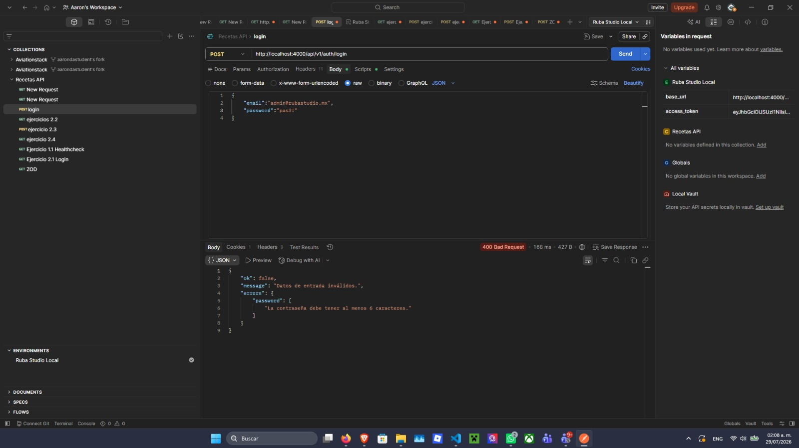
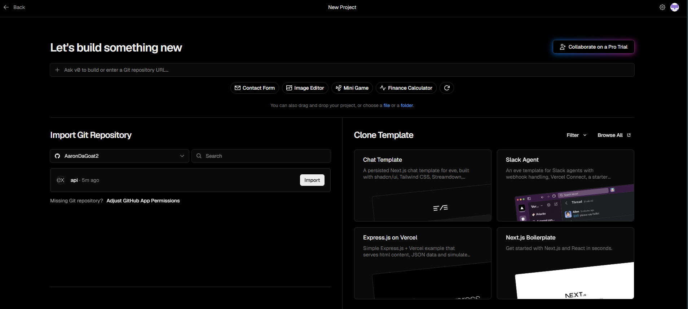
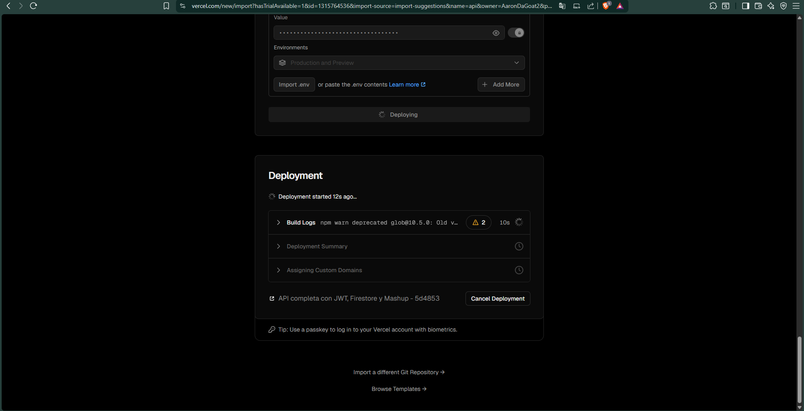
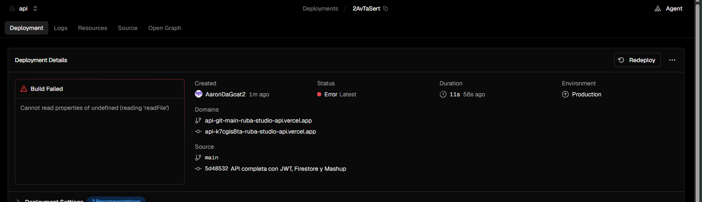
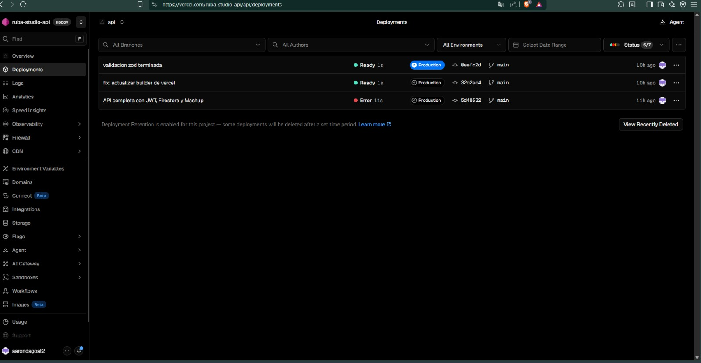

# 🔒 RubaStudio Auth & Mail API

API Serverless propia desarrollada en TypeScript para la gestión de autenticación, control de sesiones (JWT) e integración híbrida (Mashup) con servicios externos (Resend y Firebase Firestore) para RubaStudio.

👨‍💻 **Desarrollado por:** Aaron Gallardo Malpica  
🌐 **URL Base de Producción:** `https://vercel.com/ruba-studio-api/api/deployments`

## 📌 Tabla de Contenidos
- [Características (Arquitectura Mashup)](#-características-arquitectura-mashup)
- [Estructura y Seguridad de Entorno](#-estructura-y-seguridad-de-entorno)
- [Endpoints de la API](#-endpoints-de-la-api)
- [Reporte de Pruebas (Zod)](#-reporte-de-pruebas-y-validación-zod)
- [Guía de Despliegue en la Nube](#-guía-paso-a-paso-de-despliegue-en-la-nube-vercel)

## 🚀 Características (Arquitectura Mashup)
- ⚡ **Arquitectura Serverless:** alojada y optimizada para la infraestructura de Vercel (PaaS).
- 🔗 **Integración Híbrida (Mashup):** consumo concurrente de la API propia junto con servicios de terceros (API de **Resend** para notificaciones por correo y **Firebase Firestore** para persistencia de datos).
- 🔄 **Gestión de sesiones:** login, verificación de perfil (`/me`), renovación silenciosa (`/refresh`) y cierre de sesión seguro (`/logout`).
- ✅ **Validación de esquemas:** rechazo *fail-fast* de datos malformados con Zod.

## 📂 Estructura y Seguridad de Entorno

**Estrategia de Seguridad:** La gestión de credenciales se realiza estrictamente mediante variables de entorno local. Se evita la exposición de claves privadas en este repositorio público gracias a la configuración del archivo `.gitignore`.

```text
api/
├── src/
│   ├── config/            
│   ├── middlewares/       
│   ├── modules/
│   └── server.ts          
├── evidence/              # 📸 Carpeta de evidencias y capturas de pruebas
├── .env                   # ⚠️ Excluido del repo. Contiene credenciales BD y Resend.
├── private.key            # ⚠️ Excluido del repo. Llave RSA para firmar JWT.
├── .gitignore             # Bloquea node_modules, .env, .DS_Store, dist/
├── vercel.json            # Script/Configuración de inicio Serverless
└── README.md
Endpoints de la API

1. POST /login | Inicia sesión y retorna token.

2. GET /me | Retorna perfil del usuario logueado.

3. POST /refresh | Renueva sesión silenciosamente.

4. POST /logout | Destruye la sesión.
## 🧪 Reporte de Pruebas y Validación (Zod)

Se implementó un middleware para evaluar esquemas de datos. A continuación, el reporte de consumo e integración interceptando peticiones inválidas:

| Caso | Descripción | Evidencia |
| :--- | :--- | :--- |
| **1** | **Contraseña por debajo del mínimo**<br>La validación intercepta la petición por longitud y retorna `400 Bad Request`. |  |
| **2** | **Error tipográfico en campo Email**<br>La validación detecta formato inválido y retorna `400 Bad Request`. |  |

---

## ☁️ Guía Paso a Paso de Despliegue en la Nube (Vercel)

El proceso de despliegue de esta API se realizó en la plataforma PaaS **Vercel** siguiendo este flujo:

| Paso | Acción | Evidencia / Resultado |
| :--- | :--- | :--- |
| **1** | **Sincronización del Repositorio**<br>Se vinculó el repositorio de GitHub con el panel de Vercel para habilitar CI/CD. |  |
| **2** | **Variables de Entorno (Seguridad)**<br>Se inyectaron los secretos de Firebase y Resend para no exponer claves en el código. |  |
| **3** | **Resolución de Build Error**<br>Fallo de TS (`readFile`). Se ajustó `vercel.json` apuntando a `@vercel/node@latest`. |  |
| **4** | **Despliegue Exitoso**<br>Vercel compiló los módulos de Node y expuso la API correctamente a producción. |  |